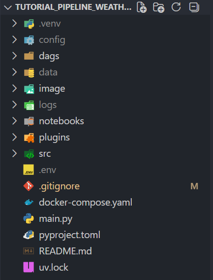
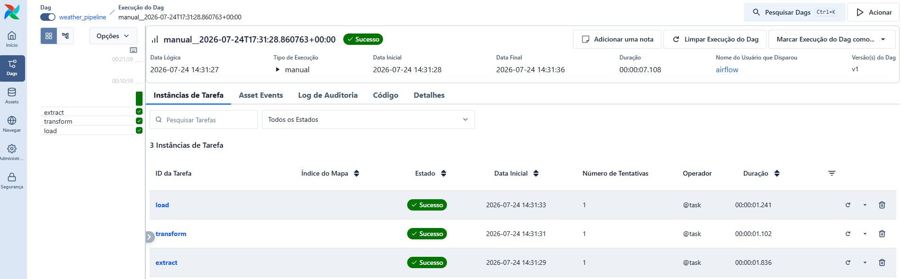

# Weather Pipeline

Este projeto implementa um pipeline de dados responsável por extrair informações meteorológicas da API OpenWeather, realizar transformações utilizando Pandas e carregar os dados em um banco PostgreSQL.

Todo o processo ETL é orquestrado por uma DAG no Apache Airflow, executada em containers Docker.

Os dados utilizados neste projeto correspondem às condições meteorológicas da cidade de São Paulo.

## Tecnologias utilizadas

- Python
- Pandas
- Apache Airflow
- Docker
- PostgreSQL

## Estrutura do projeto

## Fluxo do pipeline

1. Extração dos dados da API OpenWeather.
2. Transformação e limpeza dos dados com Pandas.
3. Conversão e padronização das colunas.
4. Armazenamento dos dados no PostgreSQL.
5. Orquestração completa através do Airflow.

## Pipeline em execução

---

Este projeto foi desenvolvido a partir do tutorial da criadora de conteúdo @vbluuiza como base para estudos em Engenharia de Dados. Foram realizadas adaptações, correções e ajustes para compatibilidade com WSL, Docker e PostgreSQL, além de alterações no pipeline para acompanhar mudanças na API utilizada.

 

**Referência:** [Tutorial da @vbluuiza](https://youtu.be/I8qPqbXQBDU?si=ix8YOU_q2vGTsqTA)
